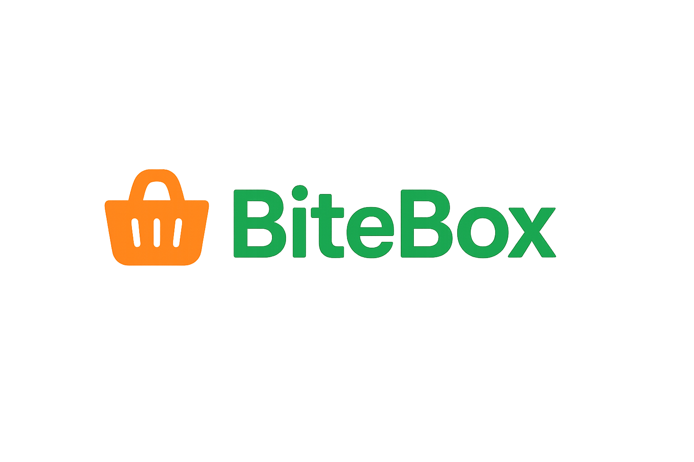

<p align="center">
  
</p>

<h1 align="center">BiteBox — Food Delivery</h1>

<p align="center">
  Modern, responsive, static site for a grocery/food brand.
  <br/>
  <a href="https://alensharhan.github.io/BiteBox-Food-Delivery/">Live Demo</a> •
</p>

---

## Features
- Responsive layout (mobile → desktop)
- Hero slider with arrows
- Categories + product grid with ratings & prices
- Add-to-cart → quantity selector + slide-in cart
- Testimonials and polished footer

## Tech
**HTML, CSS, JavaScript (vanilla)** • Deployed with **GitHub Pages (Actions)**

## Quick Start
```bash
git clone https://github.com/alensharhan/BiteBox-Food-Delivery.git
cd BiteBox-Food-Delivery
